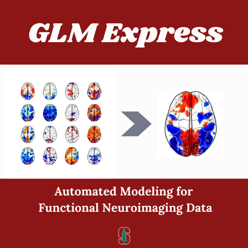

# GLM-Express

This is a package for modeling functional neuroimaging tasks. As the name implies, it's optimized to be simple and straightforward! The `task_information.json` file stores all of the regressors and modeling specifications for each task; modifying this file allows you to test a range of analytical outcomes.

## Assumptions

We assume the following about your data:

* Your data is in valid `BIDS` format       
* Your data has been preprocessed by `fmriprep` 
  * These preprocessed data are stored in a `derivatives` folder nested in your `BIDS` project  
* You have adequate events TSV files for all of your functional tasks  
* Any parametric modulators are stored within each event file  
  * Otherwise, you can build custom design matrices and feed them into the modeling function

## About `task_information.json`

Glossary of keys in the `task_information` file; manipulating these can dramatically change the specifications of your first-level model

* `tr`: Repetition time (defined here, but can be overriden for any one subject)
* `excludes`: Subjects in your project you need to exclude for a given task
* `condition_identifier`: Column in your events file that denotes trial type; **NOTE** this will be changed to `trial_type` in the script
* `confound_regressors`: Regressors to include from `fmriprep` output
* `auxilary_regressors`:
* `modulators`: Parametric modulators to weight trial type (these should be in your events file)
* `block_identifier`: Column in your events file that denotes block type; defaults to `null`
* `design-contrasts`: Your defined contrasts! Include as few or as many as you see fit